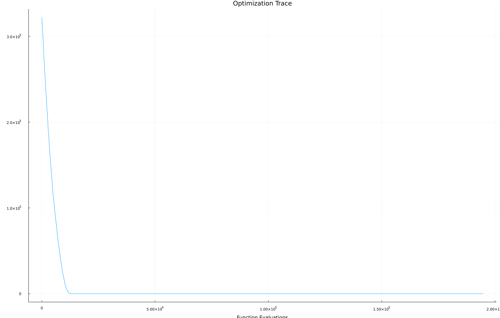
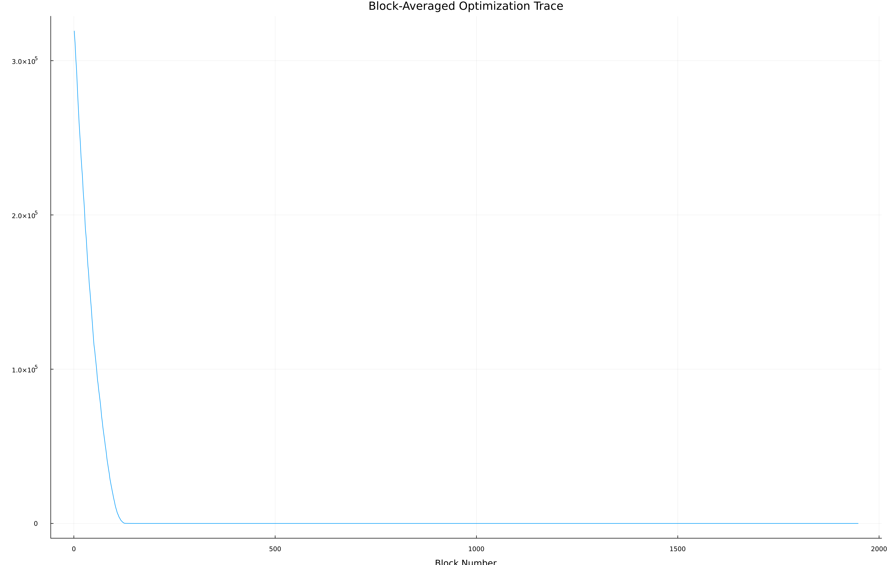
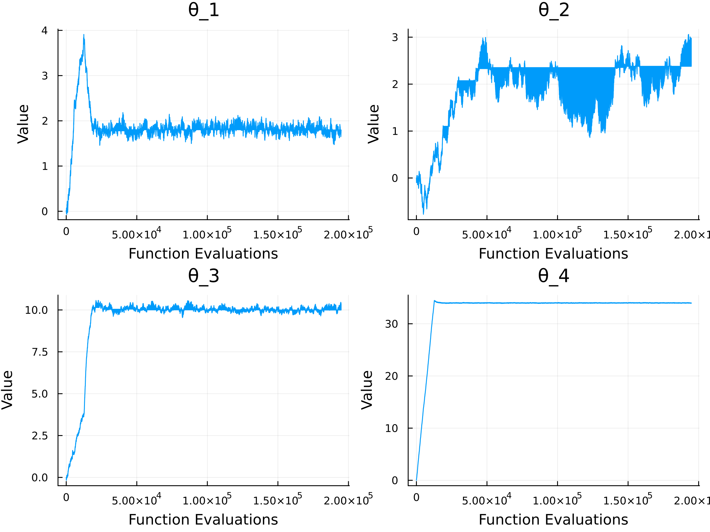

To reproduce the results in this report, get the replication files in [my GitHub repository pset3 folder](https://github.com/fredmilhome/eesp-CME/tree/main/pset3) and follow the README.md. You're supposed to simply render this report if you did everything right.

Below we just set up the environment.

```{julia}
#| output: false
include("code/setup_env.jl")

# External packages
using Random, PrettyTables, Printf, DataFrames, Optim, NLopt, ForwardDiff, FastGaussQuadrature, Plots
mkpath("figures")

# My functions and types for this problem set are packed in this module
include("code/Pset3.jl")
using .Pset3


# Set seed; used in random optimization algorithms and Monte Carlo integration
Random.seed!(201010)
```

# Part 1: Optimization

For this part, the chosen optimization algorithms are Nelder-Mead, Gradient Descent, CRS, and Simulated Annealing.

```{julia}
#| output: false

myf = x -> x * sin(5x)

lb_opt = [0.0]
ub_opt = [10.0]

optimizers = [NelderMeadI(x0=0),
              GradientDescentI(x0=0),
              CRSI(lb=lb_opt, ub=ub_opt, N_args=1, pop = 300, maxeval = 150),
              SimAnnI(lb=0.0, ub=10.0, x0=0, temp_schedule_par = 0.5, maxiter=250)]

names   = ["Nelder-Mead", "Gradient Descent", "CRS", "Simulated Annealing"]
results = [numoptimize(myf, opt) for opt in optimizers]
# Table snippet omitted
```

```{julia}
#| output: asis
#| echo: false
io = IOBuffer()
pretty_table(io,
    DataFrame(
        Algorithm  = names,
        Minimizer  = [r.minimizer[1] for r in results],
        f_min      = [r.f_min       for r in results],
        f_evals    = [r.f_evals     for r in results]
    );
    column_labels = ["Algorithm", "Minimizer", LatexCell("\$f^*\$"), "Function Evaluations"],
    formatters    = [(v, i, j) -> j ∈ (2,3) ? @sprintf("%.6f", v) : v],
    backend       = :latex)
display("text/latex", String(take!(io)))
```

If we started with $x_0 = 10$ for Nelder-Mead and Gradient Descent, they would have managed to find the global minimum, as we can see below (code snippet omitted). 

```{julia}
#| echo: false
#| output: true

myf = x -> x * sin(5x)

lb_opt = [0.0]
ub_opt = [10.0]

optimizers = [NelderMeadI(x0=10),
              GradientDescentI(x0=10),
              CRSI(lb=lb_opt, ub=ub_opt, N_args=1, pop = 300, maxeval = 150),
              SimAnnI(lb=0.0, ub=10.0, x0=10, temp_schedule_par = 0.5, maxiter=250)]

names   = ["Nelder-Mead", "Gradient Descent", "CRS", "Simulated Annealing"]
results = [numoptimize(myf, opt) for opt in optimizers]

io = IOBuffer()
pretty_table(io,
    DataFrame(
        Algorithm  = names,
        Minimizer  = [r.minimizer[1] for r in results],
        f_min      = [r.f_min       for r in results],
        f_evals    = [r.f_evals     for r in results]
    );
    column_labels = ["Algorithm", "Minimizer", LatexCell("\$f^*\$"), "Function Evaluations"],
    formatters    = [(v, i, j) -> j ∈ (2,3) ? @sprintf("%.6f", v) : v],
    backend       = :latex)
display("text/latex", String(take!(io)))
```

# Part 2: Minimizing the quadratic difference

```{julia}
#| output: asis
function tgt_f(x::AbstractVector{<:Real},θ::AbstractVector{<:Real})
    return θ[1] * x[1] + θ[2] * exp(-x[2]*x[2]) + θ[3] * log(1+abs(x[2]))+θ[4]*(x[1]^x[2])
end

# We'll use trace to keep track of the optimization path and answer item d
trace = DataFrame(eval = Int[], theta = Vector{Float64}[], value = Float64[])
k = Ref(0) # To keep track of the number of evaluations

function g(θ::AbstractVector{<:Real})
    known_values = [(1.0, 1.0) => 43.614,
                    (2.0, 4.0) => 563.694,
                    (-1.0, 2.0) => 43.23,
                    (2.0, -2.0) => 23.13
                    ]
    result = sum((tgt_f(collect(x), θ) - y)^2.0 for (x, y) in known_values)

    # Record the evaluation in the trace
    push!(trace, (eval = k[], theta = collect(θ), value = result))
    k[] += 1
    return result
end

val_b = @sprintf("%.6f", g([0.0, 0.0, 0.0, 0.0]))
display("text/latex", "Item b: \$g(\\theta = [0, 0, 0, 0]) = $val_b\$.")
```

To minimize the $g$ function, I chose the Simulated Annealing algorithm in Optim without bounds, which allows us to explore different regions of the parameter space by controlling the temperature function schedure parameter, and requires us to set the variance of the new draws. The algorithm is run for 10,000 iterations, which seem enough to minimize the function as we'll see below. We begin from the initial guess of $\theta = [0, 0, 0, 0]$ as I don't know anything yet.

```{julia}
#| output: asis
opt = SimAnnNBI(x0=[0.0, 0.0, 0.0, 0.0], step_size=0.01, maxiter=100_000)
result   = numoptimize(g, opt)
fmin_str = @sprintf("%.6f", result.f_min)
min_str  = join([@sprintf("%.2f", x) for x in result.minimizer], ", ")
display("text/latex", "Item c: Optimal \$g\$ is \$$fmin_str\$, with minimizer \$[$min_str]\$.")
```

Let's analyze the trace of the optimization to see how the algorithm converged and if 100,000 iterations were enough.

```{julia}
#| output: false
sum_trace = trace_summary(trace; block=100) # see Utils.jl

# Plot snippet omitted
```
```{julia}
#| echo: false
#| output: false
p1 = plot(trace.eval, trace.value, xlabel="Function Evaluations", ylabel="Quadratic Difference", title="Optimization Trace", legend=false)
p2 = plot(sum_trace.bin, sum_trace.avg_value, xlabel="Block Number", ylabel="Quadratic Difference", title="Block-Averaged Optimization Trace", legend=false)

p3 = plot(layout=(2,2), size=(800,600))
for i in 1:4
    theta_i = [row[i] for row in trace.theta]
    plot!(p3[i], trace.eval, theta_i,
          xlabel="Function Evaluations", ylabel="Value",
          title="θ_$i", legend=false)
end

savefig(p1, "figures/trace_rugged.png")
savefig(p2, "figures/trace_block.png")
savefig(p3, "figures/trace_theta.png")
```







It seems enough, but I was puzzled by why the parameters converged so differently. We can think that as we're drawing points from a normal, parameters that cause large changes in $g$ (e.g., $\theta_3$) will have more volatile traces and frequently exploit some flat regions, as several draws get rejected.

# Part 3: Expectations

```{julia}
#| echo: false
#| output: false
function u(x1, x2)
    return max(x1, x2)
end
```

## Gauss-Hermite Quadrature

For Gauss-Hermite, we *could* do a 2D quadrature, but the order-statistic identity for the maximum of $k$ i.i.d. standard normal random variables allows us to reduce the problem to a 1D integral, which is much more efficient to compute. 

```{julia}
#| output: asis
using Distributions: cdf, Normal

# Order-statistic identity: E[max(X,Y)] = 2·E[X·Φ(X)] for X,Y ~ N(0,1) i.i.d.
Φ(x) = cdf(Normal(), x)
u_1d(x) = 2 * x * Φ(x)

result_gh = numexpectation(u_1d, GaussHermiteI(n=10))
gh_str = @sprintf("%.6f", result_gh)
display("text/latex", "The expected utility is \$$gh_str\$ using Gauss-Hermite quadrature with 10 nodes.")
```

## Monte Carlo Integration
```{julia}
#| output: asis
# Generate draws
num_draws = 100_000
sample = [randn(num_draws) randn(num_draws)]

# Honestly I just did it like this for completeness, because my method just takes an average... but a more flexible implementation could take a pdf and weight the draws if necessary.
result_mc = numexpectation(u, sample, MonteCarloI())
mc_str = @sprintf("%.6f", result_mc)
display("text/latex", "The expected utility is \$$mc_str\$ using Monte Carlo integration with $num_draws draws.")
```

# Part 4: Integration

```{julia}
#| output: asis
n_list = [3, 5, 10, 15, 20]

functions = ["x"           => x -> x,
             "x\\sin(x)"   => x -> x * sin(x),
             "\\sqrt{1-x^2}" => x -> sqrt(1-x^2)]

analytical_integrals = [x -> x^2/2, 
                        x -> sin(x) - x * cos(x), 
                        x -> (1/2) * (x * sqrt(1-x^2) + asin(x))
                        ]

for (name, f) in functions
    results = [numintegrate(f, 0, 1, TrapezoidalI(n=n)) for n in n_list]
    io = IOBuffer()
    pretty_table(io, DataFrame(n = n_list, Integral = results);
        column_labels = [LatexCell("\$n\$"), LatexCell("Value")],
        formatters    = [(v, i, j) -> j == 2 ? @sprintf("%.6f", v) : v],
        backend       = :latex)
    display("text/latex", "\$f(x) = $name\$\n\n" * String(take!(io)))
end

```

# Part 5: Differentiation


```{julia}
#| output: false
hstep_list = [0.001, 0.005, 0.01, 0.05]
order_list = [2, 4, 6]
functions = ["x"           => x -> x*x,
             "\\log(x)"   => x -> log(x),
             "x \\sin(x)" => x -> x * sin(x)
             ]

analytical_derivatives = [x -> 2x, 
                          x -> 1/x, 
                          x -> sin(x) + x*cos(x)
                          ]

eval_x = [5.0, 10.0, 1.0]

rows = [(ord, h) for ord in order_list for h in hstep_list]
n    = length(rows)

data = Matrix{Any}(undef, n, 2 + 2*length(functions))
for (i, (ord, h)) in enumerate(rows)
    data[i, 1] = ord
    data[i, 2] = h
    for (j, ((_, f), f′)) in enumerate(zip(functions, analytical_derivatives))
        v = numdifferentiation(x -> f(x[1]), [eval_x[j]], CentralFDI(h=h, coefs=ord))
        data[i, 2 + 2*(j-1) + 1] = v
        data[i, 2 + 2*(j-1) + 2] = abs(v - f′(eval_x[j]))
    end
end
# Table snippet omitted
```

```{julia}
#| output: asis
#| echo: false
fnames = first.(functions)
top    = vcat(["", ""],                    [[LatexCell("\$$fn\$"), LatexCell("\$$fn\$")] for fn in fnames]...)
bot    = vcat(["Order", LatexCell("\$h\$")], [["f'", "Error"] for _ in fnames]...)
column_labels = [top, bot]

fmt = (v, i, j) -> j == 1 ? v :
                   j == 2 ? @sprintf("%.4f", v) :
                   j % 2 == 1 ? @sprintf("%.6f", v) :
                   @sprintf("%.2e", v)

io = IOBuffer()
pretty_table(io, data; column_labels, formatters = [fmt], backend = :latex)
display("text/latex", String(take!(io)))
```

We can see above that the error from the analytical derivative generally decreases as we increase the order of the method and decrease the step size, which is what we would expect. However, for very small step sizes, the error starts to increase again due to numerical issues.